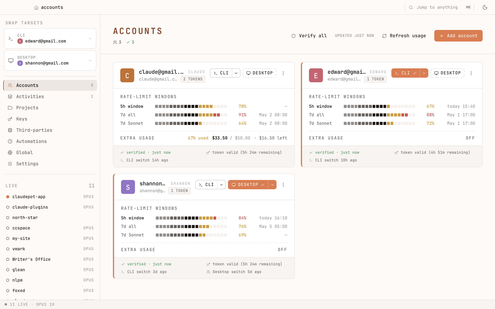
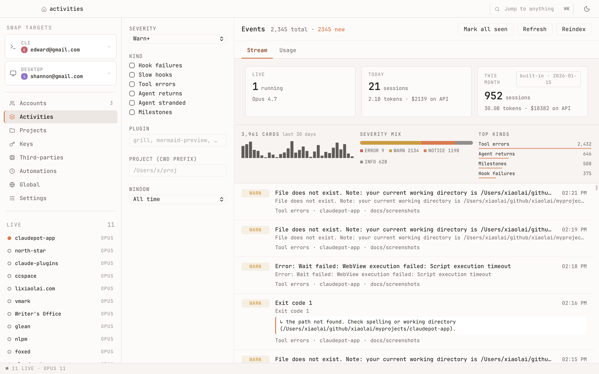
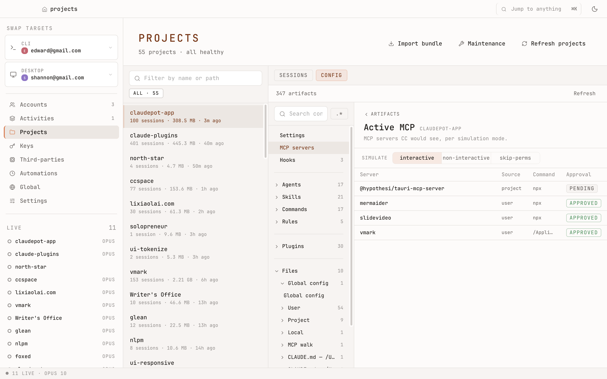
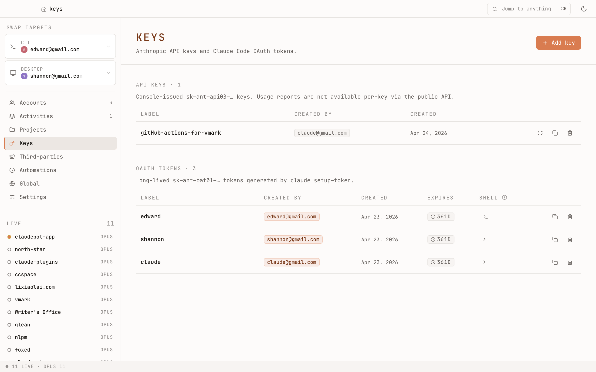
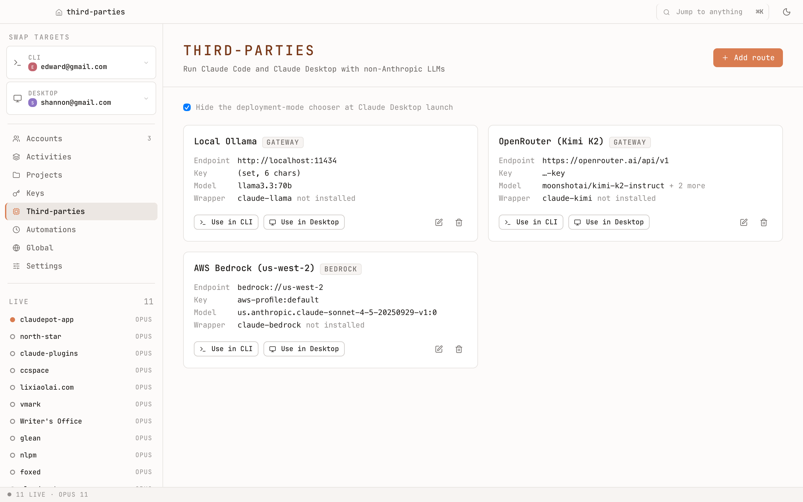
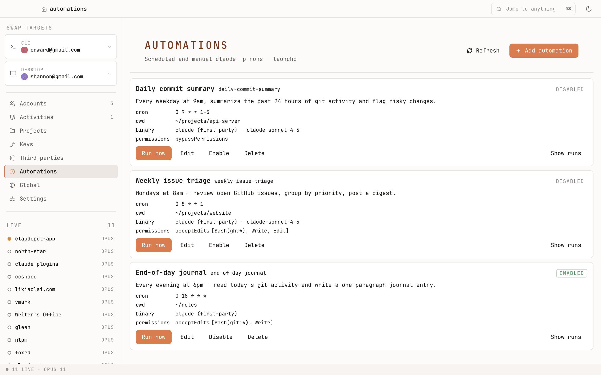
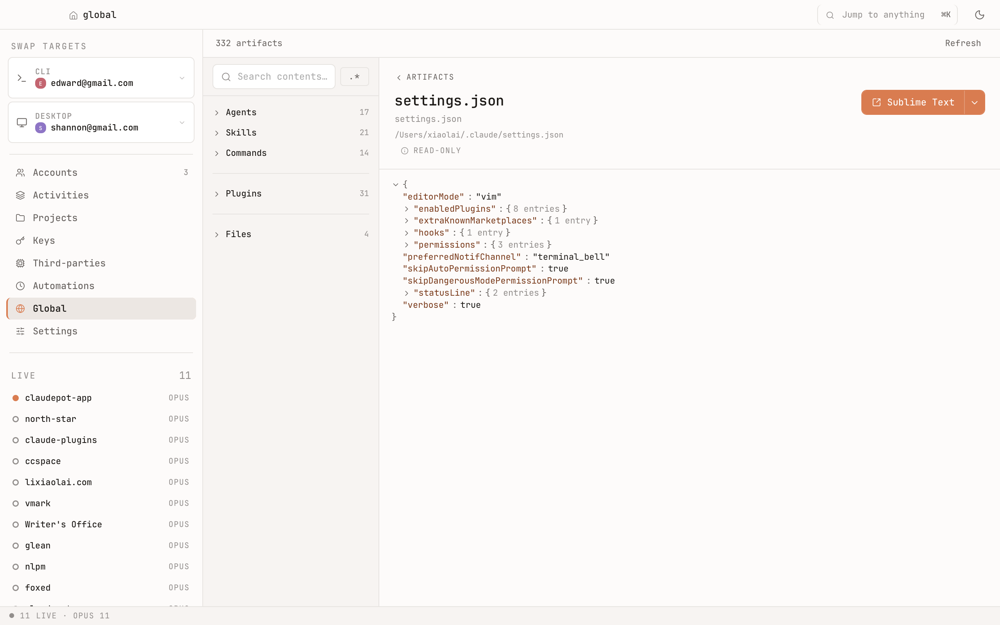
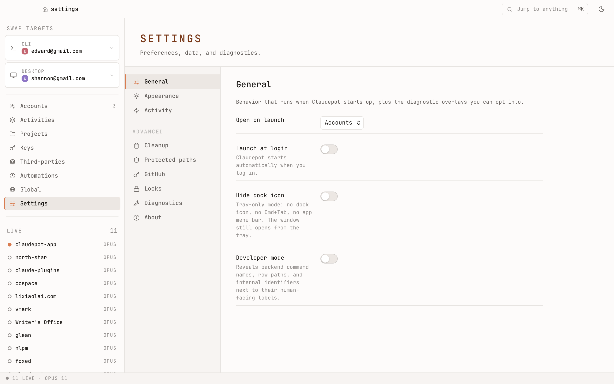

<p align="center">
  
</p>

<h1 align="center">Claudepot</h1>

<p align="center">
  <strong>A control panel for Claude Code and Claude Desktop.</strong><br>
  Switch accounts. Watch what's running. Schedule prompts. Find old chats. Reclaim disk space.
</p>

<p align="center">
  <a href="#what">What</a> ·
  <a href="#why">Why</a> ·
  <a href="#how">How</a> ·
  <a href="#for-developers">For developers</a>
</p>

---

## What

Claudepot is a desktop app — with a matching command-line tool — that sits next to Claude Code and Claude Desktop and gives you the things they don't have on their own:

- **Account switching.** Keep work and personal accounts side by side; switch in one click.
- **A live view.** See every Claude session that's running right now, including which one is waiting on you.
- **Scheduled prompts.** Have Claude run a prompt every morning, every weekday, or on any cron schedule you like.
- **Searchable history.** Find that chat from last week. Reopen it. Export it.
- **Safe project rename.** `mv`-ing a project folder breaks Claude's session history. Claudepot doesn't.
- **Disk cleanup.** `~/.claude/` quietly grows to many gigabytes. One click reclaims most of it, with a 7-day undo.
- **Privacy on export.** Tokens, auth headers, and cookies are stripped before any session leaves your machine.

It's macOS-first today. Windows and Linux build clean and work, with less polish.

## Why

If you use Claude Code or Claude Desktop daily, you've probably hit at least one of these. Each one is a first-class fix in Claudepot, not a workaround.

| Pain                                                             | What's actually going on                                                                                  |
| ---------------------------------------------------------------- | --------------------------------------------------------------------------------------------------------- |
| `/login` doesn't switch accounts when one is already signed in   | Claude reads from a single keychain slot. There's no concept of "the other account."                      |
| You renamed a project folder and your old sessions disappeared   | Claude indexes sessions by the folder's full path. Rename the folder and the index breaks.                |
| `~/.claude/` is using 8 GB and you don't know why                | Every chat is kept forever as a transcript file, including image data and tool output. Nothing prunes it. |
| Claude Code freezes on a long conversation                       | A single transcript over \~50 MB stalls the parser.                                                       |
| You can't tell which Claude session needs your attention         | Claude has no notion of "I'm waiting on you" — you have to check each terminal.                           |
| You've leaked tokens by pasting a screenshot or exporting a chat | Tokens appear verbatim in transcripts and exports.                                                        |
| You want Claude to run a daily summary at 8am                    | There's no scheduler.                                                                                     |
| You hit a rate limit you didn't know existed                     | The 5-hour window, 7-day window, and Opus split are invisible until you trip them.                        |

## How

### Install

> **Status: beta** (`0.1.6`). Daily-driven on macOS. Windows and Linux builds are green but less seasoned.

You'll need a recent **Rust toolchain** ([rustup.rs](https://rustup.rs)) and **Node 20+** with **pnpm** ([pnpm.io](https://pnpm.io)). No other system dependencies.

```bash
git clone https://github.com/xiaolai/claudepot-app.git
cd claudepot-app

# Command-line tool
cargo build -p claudepot-cli --release
# Built binary: ./target/release/claudepot

# Desktop app
pnpm install
pnpm tauri build --no-bundle      # builds a binary, no installer
# OR
pnpm tauri dev                    # run the GUI in dev mode
```

Pre-built installers are coming. Until then it's source-build only.

Your data lives at `~/.claudepot/` (override with `CLAUDEPOT_DATA_DIR`).

### First run

Open the app. The left sidebar is your map of the whole product — **eight tabs, each one a feature**. Start by adding your accounts under **Accounts**. Three ways:

- Browser OAuth — a one-time browser sign-in, no token handling on your part.
- Import the account Claude Code is currently signed into.
- Paste a refresh token if you already have one.

After that, switch with one click from the sidebar, the ⌘K command palette, or the menu-bar tray icon. Two slots, switched independently: one for **Claude Code CLI**, one for **Claude Desktop**. Work account in CLI, personal in Desktop, at the same time.

### Features, one per sidebar tab

**Accounts** — Manage every Claude account you have. Add, remove, verify, and switch between them. Two slots — one for the CLI, one for the Desktop app — switched independently. Per-account secrets live in the OS keychain.



**Activities** — Three time-scales of "what's happening with Claude right now": a live strip (running sessions, sorted by who needs attention first), a today/month dashboard, and a stream of recent events. macOS notifications when a session goes from `busy` to `waiting`.



**Projects** — Every project Claude has ever touched, with all its sessions. Cross-project text search, filters by date / error / size / token count. **Rename a project here** instead of `mv`-ing it — Claudepot rewrites every reference Claude has (session transcripts, project map, history file, memory, settings) in nine journaled phases. Resumable on crash, fully reversible.



**Keys** — All your API keys and OAuth tokens, in one inventory. Stored in the OS keychain (macOS Keychain / Windows Credential Manager / Linux Secret Service). Copy with self-clearing clipboard — the value wipes itself after 30 seconds.



**Third-parties** — Run non-Anthropic models through the same `claude` interface. Each route installs as a wrapper binary on `PATH` and a separate Desktop profile, so first-party Claude is never touched.



**Automations** — Schedule a `claude -p` prompt to run on a cron expression (every weekday at 8am, every Monday morning, anything cron can express) or on demand. Each run lands in a history pane with stdout, stderr, and exit code. macOS uses launchd, Windows uses Task Scheduler, Linux uses systemd-user timers — set up for you, not by hand.



**Global** — Browse your user-wide Claude Code configuration in one place: user prefs, global config, plugins, memory across projects, managed policy. Read-only inspection — handy when something behaves oddly and you need to know which config layer is responsible.



**Settings** — Theme and density (paper-mono light / dark), Activity preferences, Diagnostics (`doctor`), Cleanup (**Prune** old/large sessions · **Slim** drops bulky tool-output payloads while keeping prompts and replies · **Trash** 7-day undo for anything deleted), Protected paths, GitHub PAT, Locks, About.



## For developers

Four user-facing nouns: **account**, **cli**, **desktop**, **project**. Three Rust crates:

| Crate            | Purpose                                                                                   |
| ---------------- | ----------------------------------------------------------------------------------------- |
| `claudepot-core` | Pure Rust library. All business logic. No Tauri dependency — testable without a webview.  |
| `claudepot-cli`  | Thin clap wrapper over core. No business logic, no HTTP, no keychain.                     |
| `src-tauri`      | Tauri 2 desktop shell calling the same core. DTOs in `dto.rs`; secrets never cross to JS. |

The CLI handler is the reference implementation; the GUI wraps the same function with a DTO layer. Both reach the same code.

### CLI reference

```text
claudepot account   list | add | remove | inspect | verify
claudepot cli       status | use <email> | clear | run <email> -- <cmd>
claudepot desktop   status | use <email>
claudepot project   list | show | move | clean | repair
claudepot session   list-orphans | move | adopt-orphan | rebuild-index
                    view | export | search | worktrees
                    prune | slim | trash {list|restore|empty}
claudepot doctor
claudepot status
```

Every command supports `--json` with a stable shape (scriptable), `--quiet`, `--verbose`, `--yes`. Exit codes: `0` ok · `1` general · `2` ambiguous / drift · `3` auth failure · `4` Desktop quit failed · `5` network.

`claudepot cli run <email> -- <cmd>` launches a one-shot command with `CLAUDE_CODE_OAUTH_TOKEN` injected, leaving the on-disk slot untouched.

### Develop

```bash
cargo check --workspace
cargo test  --workspace               # 1700+ Rust tests
pnpm test                             # Vitest + RTL, jsdom (~400 tests)
pnpm test:coverage                    # with coverage report
pnpm tauri dev                        # GUI hot reload (Vite :11220, HMR :11221)
```

Path-handling code (sanitize, unsanitize, canonicalize, tilde expansion) is the highest-risk surface; it's golden-tested on Linux / macOS / Windows in CI. See [`.claude/rules/paths.md`](.claude/rules/paths.md).

Full design lives in [`dev-docs/implementation-plan.md`](dev-docs/implementation-plan.md). The 3400-line CC/Desktop internals reference is at [`dev-docs/kannon/reference.md`](dev-docs/kannon/reference.md).

### Security posture

- Tokens never logged, toasted, or sent to the webview. Truncated in any human output (`sk-ant-oat01-Abc…xyz`).
- Per-account secrets in the OS keychain (macOS Keychain, Windows Credential Manager, Linux Secret Service).
- Two distinct keychain surfaces on macOS: the `keyring` crate for Claudepot's own secrets, the `/usr/bin/security` subprocess for Claude Code's `Claude Code-credentials` keychain item. They are not interchangeable.
- Redaction (`sk-ant-*`, OAuth bearers, JWTs, `Authorization` headers, URL params, cookies) runs before any session event reaches the UI or the SQLite index.
- SQLite WAL/SHM sidecars are forced to `chmod 0600`.
- Tauri `opener` scope is narrowed to `https://console.anthropic.com/settings/keys`.

Full rules in [`.claude/rules/architecture.md`](.claude/rules/architecture.md).

## License

ISC — see [LICENSE](./LICENSE).
