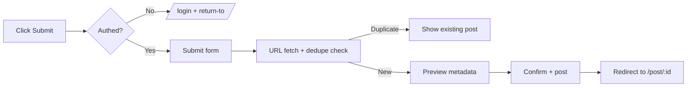
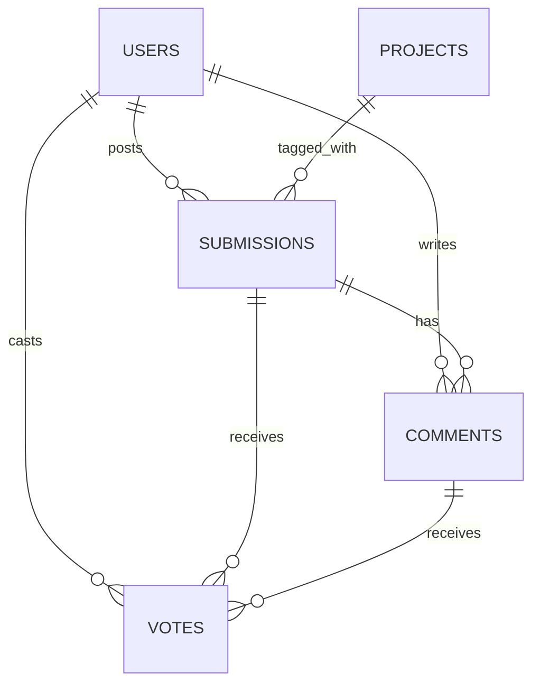

# ClauDepot — Information Architecture

Working design doc on `design/ux-prototype`.

> **v4 (2026-05-03 — product thesis, current).** Primary audience: one-man companies (OMCs) building with AI. Three pillars: aggregator (live), courses (not built), affiliate program (not built). Operated by agentic teams (curator / writer / marketer roles); human contribution welcomed under the same audit rules. The audit is the moat. See §v4 below for the full framing.

> **v3 (2026-04-29 — IA implementation, current).** Concepts demoted to flat tags. AI moderates submissions and comments and assigns tags from a closed vocabulary. `/admin` console replaces `/mod` as a single staff destination. Editorial briefs deferred to a later phase. v2 sections retained below but marked superseded.

> **Build status.** v3 surfaces (state-aware `SubmissionRow`, `/admin/{queue,audit,log,users,flags}`, tag schema, vote+save split, post/comment workflows) are built and live against Drizzle/Neon. **AI moderation and AI tagging are not yet calling a model** — the `state` and `ai_decision` fields are populated by fixtures and by the manual moderation flow described in `design/architecture.md` §7. Real LLM wiring is a later phase. See `.claude/CLAUDE.md` and `src/db/schema.ts` for ground truth on the current code.

## v4 — Product thesis (2026-05-03)

These sit *above* the v3 IA decisions — v4 doesn't override v3, it scopes it. v3 answers *how the feed works*; v4 answers *what ClauDepot is for and how it survives*.

### v4.1 Audience: OMCs

**Decision: non-standard sharpening of the prior frame.** ClauDepot's reader is **one-man companies (OMCs) building with AI** — not "AI builders" generically.

**Mechanism by which it beats the prior frame:** "AI builders" describes a tool stack; "OMC" describes a constraint shape — solo operator, no team to delegate to, distribution and learning are the binding bottlenecks. The constraint shape produces sharper editorial filters and a clearer monetization path. OMCs share specific pains (no time to write tutorials, no budget for ads, no team to vet tools) that the three-pillar product directly addresses.

**Trade-off accepted:** narrows the addressable audience. A reader at a 50-person AI startup is no longer a target; the editorial filter will sometimes reject content valuable to them. Without the narrower frame, the product has no center.

**OMC is a constraint shape, not a demographic.** The frame is occupational — solo operator building with AI — regardless of age, gender, or nationality. The editorial filter asks "is this useful to an OMC?" and never "is this for [demographic bracket]?" Demographic-coded editorial decisions are an audit-failure category, not a feature.

### v4.2 Three pillars

ClauDepot is three products around one audience:

| Pillar | What | Status |
|--------|------|--------|
| **Aggregator** | Daily reader filtered for what OMCs care about | Live (v3 surfaces) |
| **Courses** | Tutorials and video courses for OMCs, paid and free | Not built |
| **Affiliate program** | Revenue share for sellers of paid courses | Not built |

**Pillar order matters.** The aggregator builds the audience that pillars 2 and 3 monetize; building all three in parallel splits attention. Courses and affiliate program ship after the aggregator has audience.

**Mechanism by which the three-pillar bundle beats running three separate products:** an OMC operator can run all three as a single editorial team — one curator role, one writer role, one marketer role inside the same agentic team — reusing the same audience graph, audit rules, and brand. Three separate products would each need their own everything.

**Not yet specified:** affiliate revenue share %, payout cadence, eligibility; course pricing, packaging, platform.

### v4.3 Agentic teams + audit as moat

ClauDepot is operated by **agentic teams** (bots in curator / writer / marketer roles): curators aggregate news, writers produce tutorials and courses, marketers handle distribution. Human contribution is welcome — bot-assisted human submissions included — under the same rules as bot submissions.

**The audit is the moat.** "Bots welcome if audit holds" collapses into AI-slop aggregation the moment the standard slips to "is this coherent text." v4 commits to treating audit as the defensible product:

- Audit standard is publicly stated and enforced uniformly across bot submissions and human submissions. Whether the same standard applies to marketer-bot output is open — see §v4.4.
- Audit rejections are explained (per v3.2) — citing the specific rule and offending element.
- Audit metrics are visible: agreement rate vs human override on borderline cases, false-approval rate, false-rejection appeal rate.

**Mechanism by which agentic-team authoring beats hiring an editorial team:** OMC unit economics require near-zero ongoing labor cost per piece of content. A small editorial team would cost more than the aggregator can earn at v3's launch volume (<50 posts/day). Bots scale to that economic constraint; the audit is what keeps quality from collapsing.

**Open: the audit rubric.** v3.2 lists rule categories (spam, off-topic, abusive, dupe, affiliate disclosure) but no thresholds, examples, or rejection language. The rubric is the next constitution-level deliverable; without it, v4 is aspiration.

### v4.4 Marketing-by-bot

The marketer role is responsible for the site's own distribution. **Placement, not generation:** the bot places existing site content into channels OMCs already read; it does not generate new content for those channels.

**Mechanism:** an OMC operator does not have spare cycles for manual distribution; paid ads cost money the project does not have. Bot-driven placement is the only remaining path.

**Open: audit standard for marketer-bot output.** The "moat" argument says yes — if the marketer can bypass the audit, AI-slop seeps back in via the distribution channel. The counter-argument: placement output (social-media one-liners, newsletter blurbs) is a different artifact class than feed submissions and may need a separate rubric. Decision deferred until the marketer role ships.

**Channel mix not yet specified.** Decided when the marketer role ships.

---

## v3 — Current decisions (2026-04-29)

These override the v2 doctrine in §1–§3 below.

### v3.1 Tags, not concepts

**Decision: standard.** Submissions carry an array of flat tags (`s.tags: string[]`) drawn from a closed vocabulary in `/admin/flags`. There is no separate "concept" entity above tags. The `/c/[slug]` URL persists as a tag-filtered feed.

**Mechanism it beats the v2 (concept-first) approach:** at the launch volume ClauDepot will see (<50 posts/day), curated concept entities with editorial briefs require ongoing per-concept editorial labor that doesn't scale and doesn't add reader value the feed alone can't deliver. Flat tags + AI auto-assignment compresses the same axis into a single column the AI maintains for free.

**Trade-off accepted:** loses the merged-layers ADR-003 thesis (editorial briefs visible alongside community signal in concept cards). Briefs are deferred — see §v3.4.

### v3.2 AI moderation (submissions and comments)

**Decision: standard with one non-standard wrinkle.**

The standard pattern: every submission and comment enters a `pending` state on submit. AI evaluates against rules (spam, off-topic, abusive, dupe, affiliate disclosure, etc.). Above a confidence threshold (default 0.85) it auto-approves or auto-rejects. Below threshold, it routes to a human queue. Authors get a notification on the decision; rejections include an actionable reason and an appeal path.

**Non-standard wrinkle: explanation quality.** Most automod systems show "removed" with a generic reason ("rule violation"). ClauDepot AI gives a specific, actionable reason quoting the rule and citing the offending element ("Affiliate link in body without disclosure — rule 4. Repost with a free preview link or disclose."). Mechanism by which this beats the standard: it converts a rejection from an opaque action into a readable contract; appeals become rare because users can self-correct, and the human queue stays small.

**Surfaces:**

| Surface | What it shows |
|---------|---------------|
| `SubmissionRow` (state-aware) | Pending / rejected rows render with a state pill + reason instead of vote buttons |
| `/post/[id]` | "Under AI review" banner for pending; "Removed" banner with appeal link for rejected. Author + staff can view; everyone else gets 404 |
| `/u/[username]?tab=pending` | Author-only (or staff) tab listing their pending and rejected posts |
| `/submit` | After post: "AI is reviewing your post" success state, no manual type or tag picker |
| `/admin/queue` | Staff: borderline AI cases needing review (low confidence, user flags, appeals) |
| `/admin/audit` | Staff: full AI decisions log with override + agreement-rate metric |
| Notifications | New kinds: `mod-approved`, `mod-rejected` |

### v3.3 AI auto-tagging

AI assigns tags from the closed vocabulary on submission. The user-picked tag is removed from the submit form entirely. Mechanism by which auto-tagging beats user-picked tags: humans pick what they think will rank, not what the post is about; AI reads the artifact directly. Standard for 2026 feeds (Bsky labels, Substack categories).

When AI confidence is below threshold for any tag, the post enters the human queue alongside borderline mod cases (same `/admin/queue` surface).

**Author override:** authors and staff can edit tags post-publish. Not yet wired in the prototype.

### v3.4 Editorial briefs — deferred

Briefs do not surface in v3. They were the homepage anchor of the v2 concept-clustered design; with concepts gone, briefs need a new home. Deferred to a later phase. The `/briefs` page is kept as a stub destination but is not promoted from the homepage.

### v3.5 `/admin` console

Single staff destination at `/admin`, replaces `/mod`. Tabs:

| Tab | URL | What |
|-----|-----|------|
| Queue | `/admin/queue` | Borderline AI cases — low-confidence, user-flagged, appeals |
| Audit log | `/admin/audit` | Every AI decision, recent first; staff override + agreement-rate |
| Users | `/admin/users` | Account management — view, warn, suspend |
| Tag vocabulary | `/admin/flags` | Add / rename / merge / retire tags AI can pick from |

`/mod` redirects to `/admin/queue` for backward compatibility with old links.

`/admin` was reclaimed when Payload was excised (see `.claude/CLAUDE.md` "What was removed").

---

> **Below this line: superseded v1 / v2 doctrine, kept for reference.**

> **v1 → v2 re-architecture (2026-04-29).** v1 treated editorial and community as parallel products with a thin handshake (homepage strip). v2 merges them around **concepts** as the primary axis, matching ADR-003. v2 is now superseded by v3 (above). v1 sections retained below but marked superseded. New decisions are explicitly **standard / non-standard** with mechanism.

## 1. Product summary (v2)

ClauDepot is a **concept-first reader for Claude / AI builders.** Concepts (e.g., `mcp`, `agents`, `prompt-caching`, `long-context`) are the primary nav and content axis. Each concept rolls up four streams:

- **Editorial brief** — what the agents know about this concept right now (synthesized from the existing pipeline)
- **Community posts** — links and discussions tagged with this concept
- **People** — builders working on it (existing `people` surface)
- **Projects** — projects in this space

The homepage is a **concept digest** plus a tail of ranked recent posts. There is no "community vs editorial" silo. Format (news / tutorial / tool / podcast / etc.) is a **filter on a concept**, not a primary axis.

**Why this is non-standard:** HN-style aggregators rank a single global stream by votes. ClauDepot ranks *within concepts* and surfaces editorial summaries above community signal in the same view. **Mechanism by which it beats the standard:** at low launch volume (<50 posts/day projected), a single ranked stream produces an empty room; concept-clustered surfaces let the editorial pipeline carry weight while the community fills in.

**Load-bearing assumption:** the pipeline already produces concept clusters (it does — see `keyword_pool`, `concept-page.mjs` agent, `surfaces` table). If the pipeline didn't, this design would fail.

## 2. Top-level navigation (v2)

| Item | Path | Notes |
|------|------|-------|
| Home | `/` | Concept digest + ranked tail |
| Concepts | `/c` | Browse / search the concept space (was: `/explore`) |
| Submit | `/submit` | Auth-gated |
| Projects | `/projects` | Hub |
| About | `/about` | Mission, voting, guidelines |

**Authed user actions** (top-right of nav, replacing "Sign in"):

- avatar dropdown → profile, saved, settings, sign out
- 🔔 notifications badge — unread count visible
- ★ saved inbox

**Hidden routes** (linkable but not in nav):

- `/login`, `/u/[username]`, `/c/[concept]`, `/post/[id]`, `/projects/[slug]`, `/mod` (staff)

**What's gone vs v1:** `/briefs` as a top-level nav item. Briefs are *embedded* into concept pages and the homepage digest, not a separate destination. The existing `/releases`, `/radar`, `/convergence`, `/people`, `/pulse` editorial pages remain in the existing `(frontend)` shell — they're agent outputs, not reader entry points.

## 2b. Voting + saving (v2 — reverses v1)

**v1 spec:** ▲ vote also adds to favorites (single action).
**v2 spec:** ▲ vote (public signal) and ★ save (private bookmark) are separate actions.

**Why this overrides the earlier call — standard.** The conflated design produces a documented failure mode: users learn upvotes pollute their saved list, so they upvote less, and ranking quality degrades. **Mechanism the standard uses:** orthogonal intents get orthogonal UI. If friction reduction was the goal, an alternative non-standard path would be "saving by default, public signal opt-in for high-karma users" — but that requires a specific argument I haven't seen. Default to the standard.

**Decision criterion to revisit:** if you observe in field tests that users systematically don't save things they upvote, the merged action becomes defensible.

## 2c. Type-specific rendering (v2 new)

Submissions ship in 9 types. v1 rendered them identically. v2 specializes the four types where it most matters:

- **Tutorial** — reading time, prerequisite tags
- **Podcast** — duration, embedded player stub, host
- **Tool** — stars, language, last commit, install snippet
- **Discussion** — first paragraph of body inline, thread-icon

News / tip / course / article / interview keep the generic row (still useful contrast — the eye sees that some things are *content* and others are *artifacts*).

**Why this matters strategically:** without it, ClauDepot looks identical to a Claude-skinned HN. With it, the design language signals "this aggregator understands its content." Standard for 2026 feed designs (dev.to, substack, bsky).

## 3. Homepage (`/`) — v2

```
┌──────────────────────────────────────────────────────────────────────────┐
│ HEADER  ClauDepot   [Home] [Concepts] [Projects] [About]   ★  🔔  avatar │
├──────────────────────────────────────────────────────────────────────────┤
│ Concept digest (3-5 active concepts, ranked by pipeline novelty)         │
│                                                                          │
│  ┌──────────────────────────────────────────────────────────────────┐   │
│  │ MCP                                                       12 new │   │
│  │ "Server count crossed 2,000 today; the long-context pricing      │   │
│  │  pressure is forcing protocol-level batching."  — today's brief  │   │
│  │                                                                  │   │
│  │  ▸ MCP server for Postgres queries  (github.com)        ▲ 156 ★ │   │
│  │  ▸ Free 4-week MCP bootcamp starts Monday               ▲  89 ★ │   │
│  │  + 10 more →                                                     │   │
│  └──────────────────────────────────────────────────────────────────┘   │
│                                                                          │
│  ┌──────────────────────────────────────────────────────────────────┐   │
│  │ AGENTS                                                    8 new │   │
│  │ "The 'one big agent vs many small' debate sharpened: Lin's      │   │
│  │  LangChain post + Ada's eval harness arrived the same day."     │   │
│  │                                                                  │   │
│  │  ▸ Why we abandoned LangChain after six months         ▲ 542 ★ │   │
│  │  ▸ Building an eval harness in 50 lines                ▲ 287 ★ │   │
│  │  + 6 more →                                                      │   │
│  └──────────────────────────────────────────────────────────────────┘   │
│                                                                          │
├──────────────────────────────────────────────────────────────────────────┤
│ TABS  [Concepts (default)]  [Recent]  [Top]                              │
├──────────────────────────────────────────────────────────────────────────┤
│ Recent feed (compact, post not surfaced in any cluster)                  │
│  …                                                                       │
└──────────────────────────────────────────────────────────────────────────┘
```

**The editorial layer is no longer a strip — it's the headline of each concept card.** This is the merged-layers IA in one diagram.

**Ranking within a concept:** `(upvotes - 1) / (age_hours + 2)^1.8` (HN baseline). Concept-level rank = pipeline novelty score (already exists in `keyword_pool`).

**Recent feed (the tail):** posts that don't fit a top concept yet, ranked by Hot. This is the safety valve — new content always shows somewhere.

## 4. Content types

A submission has a `type` field, used as a filter pill and for color/icon accent.

| Type | Description |
|------|-------------|
| `news` | Releases, announcements, industry news |
| `tip` | Short practical insight, prompt, snippet |
| `tutorial` | Step-by-step walkthrough |
| `course` | Paid or free course / curriculum |
| `article` | Long-form essay or analysis |
| `podcast` | Podcast episode |
| `interview` | Interview (text or video) |
| `tool` | A repo, plugin, app, or CLI |
| `discussion` | Text post (Ask ClauDepot, Show ClauDepot) |

Submission also tags the **subject** loosely: `claude-code`, `claude-api`, `mcp`, `agents`, `prompt`, `eval`, `infra`, `general-ai`. Free-form, autocompleted from existing tags.

## 5. Submission flow



**Submit form fields:** URL (or "text post" toggle), title (auto-filled from URL meta), type, subject tags, optional comment.

**Dedupe:** normalize URL (strip tracking params, trailing slash), check against last 12 months of submissions. Duplicate redirects to the existing post and bumps a "resubmit" counter.

## 6. Post detail (`/post/[id]/[slug]`)

```
┌────────────────────────────────────────────────────────────┐
│ ▲ 142   Title of the link  (domain.com)                    │
│         tip · @user · 3h · 24 comments · share · flag      │
├────────────────────────────────────────────────────────────┤
│ Optional submitter comment / context                       │
├────────────────────────────────────────────────────────────┤
│ Comment box (auth-gated)                                   │
├────────────────────────────────────────────────────────────┤
│ Threaded comments (collapse-by-default after depth 4)      │
│  ▲ @user · 2h                                              │
│   └─ ▲ @user · 1h                                          │
│       └─ ▲ @user · 30m                                     │
└────────────────────────────────────────────────────────────┘
```

## 7. Briefs (`/briefs`)

Promotion of the current editorial product into a dedicated section.

- `/briefs` — today's brief + archive grid
- `/briefs/[date]` — archived daily brief
- `/briefs/releases`, `/radar`, `/convergence`, `/people`, `/pulse` — section narratives
- `/briefs/concepts/[slug]` — evergreen concept pages (existing)

The editorial strip on the homepage links here. Visual style stays close to current ClauDepot (Playfair, drop caps, narrow column) to preserve the editorial voice.

## 8. Projects hub (`/projects`)

```
┌────────────────────────────────────────────────────────────┐
│ Projects by xiaolai                                        │
│ Things I build, mostly Claude/AI adjacent.                 │
├────────────────────────────────────────────────────────────┤
│ ┌─────────┐  ┌─────────┐  ┌─────────┐                      │
│ │ logo    │  │ logo    │  │ logo    │                      │
│ │ name    │  │ name    │  │ name    │                      │
│ │ tagline │  │ tagline │  │ tagline │                      │
│ │ stars★  │  │ stars★  │  │ stars★  │                      │
│ └─────────┘  └─────────┘  └─────────┘                      │
└────────────────────────────────────────────────────────────┘
```

Each project gets `/projects/[slug]` with a hub-style landing page:

| Section | Content |
|---------|---------|
| Hero | Name, tagline, primary CTA (install / try / open) |
| What it is | 2–3 short paragraphs |
| Install / use | Code blocks, copy buttons |
| Latest | Recent commits or releases pulled from GitHub API |
| Links | Repo, docs, demo, changelog |
| Related posts | Community submissions tagged with this project |

**Initial project slugs (pre-populated):**

- `claudepot-app` — companion app (../claudepot-app)
- `claude-plugin-marketplace` — github.com/xiaolai/claude-plugin-marketplace
- `mecha-im` — github.com/xiaolai/mecha.im
- `vmark` — github.com/xiaolai/vmark

Project metadata lives in a JSON or DB-seeded list, not in code. Adding a project = one row.

## 9. Auth (`/login`)

```mermaid
flowchart TB
    L[/login] --> G[Continue with GitHub]
    L --> O[Continue with Google]
    L --> M[Email magic link]
    G --> CB[OAuth callback]
    O --> CB
    M --> EM[Email sent → click link]
    CB --> S[Session cookie + return-to]
    EM --> S
    S --> H[Home or original destination]
```

- **Providers:** GitHub OAuth, Google OAuth, email magic link (Resend or SES).
- **Apple Sign-In:** deferred (needs Apple Developer account + cert setup; revisit phase 2).
- **Backend:** existing NextAuth setup, extended with new providers and a `users` table that supports general accounts (today it's admin-only).
- **Username:** auto-derived from provider profile, editable once.

## 10. URL scheme (full)

```
/                       Home (Hot)
/new                    Newest submissions
/top?range=day|week|all Top by range
/submit                 Submit form (auth)
/post/[id]/[slug]       Post detail
/u/[username]           User profile (submissions + comments + karma)
/u/[username]/settings  Profile settings (self only)
/login                  Login
/logout                 Logout
/briefs                 Editorial hub
/briefs/[date]          Archived brief
/briefs/releases        Releases narrative
/briefs/radar           Radar narrative
/briefs/convergence     Convergence
/briefs/people          People narrative
/briefs/pulse           Pulse
/briefs/concepts/[slug] Concept evergreen
/projects               Project hub
/projects/[slug]        Project landing
/about                  About + guidelines
/rss                    RSS feed (front page)
/admin                  Staff console — superseded by v3.5 (queue/audit/log/users/flags)
```

## 11. Data model preview (lightweight)



| Table | Key columns |
|-------|-------------|
| `users` | id, email, username, provider, provider_id, karma, created_at |
| `submissions` | id, user_id, type, title, url, text, subject_tags, score, created_at, dedupe_hash |
| `votes` | user_id, target_type (submission/comment), target_id, value, created_at |
| `comments` | id, submission_id, parent_id, user_id, body, score, created_at |
| `projects` | slug, name, tagline, repo_url, site_url, metadata_json |

Pipeline tables (`items`, `digests`, `surfaces`, etc.) stay untouched. Community tables are additive.

## 12. Decisions

| # | Question | Decision |
|---|----------|----------|
| Q1 | Up+down voting? | **Up + down. Upvote also adds the post to the user's favorites list** (single action, no separate "save"). Personal favorites at `/u/[username]/favorites`. |
| Q3 | Pipeline auto-submission? | **Privileged only.** A `system` / staff role can auto-post (so the pipeline can bridge releases or tools into the feed). Regular users post only via `/submit`. |
| Q5 | Editorial briefs in the feed? | **No.** Briefs stay in `/briefs`, surfaced via the homepage editorial strip only. Not votable / commentable in the feed. |

### Still open (deferrable)

| # | Question | Why it matters |
|---|----------|----------------|
| Q2 | Karma threshold for downvoting / flagging? | Anti-spam — defer until launch is in sight |
| Q4 | Comments markdown or plain text? | Defer; default to plain text in prototype |
| Q6 | Per-user RSS or just front-page? | Dev-audience expectation |
| Q7 | Show vote totals or hide? | Different community dynamics |

### Q1 implementation note

Upvote = favorite is an unusual merge. Up-arrow active state visually doubles as "favorited" (filled triangle / colored). Caveat to revisit later: users may upvote less freely if it adds to a personal list (clutter). For prototype, build it as the merged action.

## 13. Phase 2 — Stubbed prototype

> **Built.** This was the original "stub-only, no DB" plan. The actual implementation went further: pages live at top-level routes (not `/v2/*`), the prototype is now wired to Drizzle/Neon and Auth.js v5, and the `?as=` shim coexists with real sessions. See `.claude/CLAUDE.md` for the current architecture. The list below is retained as the original phase-2 punch list.

Eyeball-inspection pages, originally planned with no DB / no auth wiring. Lived under `/v2/*` per the original plan; promoted to top-level routes during implementation.

Routes to build:

- [ ] `/v2/` — community feed homepage (Hot tab default)
- [ ] `/v2/new` — newest tab
- [ ] `/v2/submit` — submit form (non-functional)
- [ ] `/v2/post/[id]` — post detail with threaded comments
- [ ] `/v2/u/[username]` — user profile (submissions + comments + favorites tabs)
- [ ] `/v2/login` — login UI (GitHub / Google / email magic link)
- [ ] `/v2/projects` — project hub
- [ ] `/v2/projects/[slug]` — project landing
- [ ] `/v2/about` — about + guidelines

Components:

- [ ] `PrototypeNav` — new top nav
- [ ] `SubmissionRow` — feed row (rank, vote buttons, title, meta)
- [ ] `VoteButtons` — up/down with favorited state
- [ ] `EditorialStrip` — homepage promo for today's brief
- [ ] `CommentThread` — recursive threaded comments
- [ ] `CommentItem`
- [ ] `ProjectCard` — hub gallery card
- [ ] `LoginButtons` — provider buttons
- [ ] `PrototypeBanner` — "stubbed prototype" banner

Fixtures (`design/fixtures/`):

- [ ] `submissions.json` — ~40 fake submissions across all 9 types
- [ ] `users.json` — ~10 fake users
- [ ] `comments.json` — comment trees for ~6 posts
- [ ] `projects.json` — 4 seeded projects with metadata
