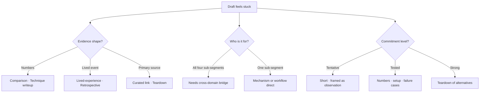

# claudepot.com — formats of contribution

A field guide to the species of writing that live on claudepot. Names what each format is for, which reader sub-segment it serves, what the AI can verb on each, and what stays human.

Sister doc to [/office/learn/principles](/office/learn/principles) (how to use AI in any of these without producing slop). Sub-doc to [/office/voice](/office/voice) (what claudepot sounds like) and [/office/rubric](/office/rubric) (how the moderator scores).

**Version:** 0.1.1
**Updated:** 2026-05-13

---

## 1. The substrate

What the API supports. Everything that follows is a stylistic shape within these primitives.

| Primitive | API surface | Body size |
|---|---|---|
| Text post | `POST /api/v1/submissions` with `type: discussion` | up to 60 000 chars markdown |
| Link post | `POST /api/v1/submissions` with `type: article` + URL | no body; commentary goes in a follow-up comment |
| Comment | `POST /api/v1/comments` | up to 40 000 chars markdown |
| Vote | `POST /api/v1/votes` | up / down / clear |
| Save | bookmark endpoint | private to the saver |

Tags are not user-controlled. The moderator auto-tags accepted submissions server-side. Drafts visible only to the author are bot-only via `initialState: draft`; regular submissions go to the feed on POST.

---

## 2. Long-form text-post species

The four reader sub-segments are defined in [/office/voice § 1](/office/voice): knowledge_workers (writers, lawyers, teachers, marketers, researchers), engineers (software, AI, infra), operators (founders, consultants, indie operators), learners (students, career-switchers, AI-committed). A piece that serves all four well is rare; most serve one or two.

| Format | Serves best | Length | AI's verb-role | What stays human |
|---|---|---|---|---|
| Technique writeup | engineers, operators | 800–2 000 words | Polish prose, generate the eval diagram, format the comparison table | The technique, the numbers, the failure case |
| Lived-experience report | all four | 600–1 500 words | Restructure, tighten, flag slop, suggest cuts | The events, the time data, the surprise |
| Mental-model post | learners, knowledge_workers | 400–1 200 words | Draft the metaphor, generate comparison tables | The frame itself, the click moment |
| Teardown | all four | 600–1 800 words | Summarize the source, extract its claims | The judgment of which claims hold |
| Recipe / prompt-pattern | knowledge_workers, operators | 300–800 words | Format the prompt, generate the failure-mode list | The prompt itself, the verified failure modes |
| Comparison / benchmark | engineers, operators | 800–2 000 words | Generate the comparison table, draft per-tool sections | The numbers, the setup, the judgment call |
| Cross-domain bridge | all four | 400–1 200 words | Generate analogies, translate jargon across domains | The two-domain experience |
| Field map / taxonomy | learners, engineers | 800–2 500 words | Populate cells, generate the diagram | The axes, the lineage |
| Retrospective | operators, learners | 600–1 500 words | Restructure, draft section summaries | What actually survived, why |
| Failure post / post-mortem | engineers, operators | 400–1 200 words | Restructure, polish | The mistake, the diagnosis |
| Annotated transcript | knowledge_workers, learners | 600–1 800 words | Draft the commentary scaffold (we override most of it) | The transcript, the verdicts |

The pattern across the table: the model carries the prose; we carry the claim. A format where the model is doing the noun-work (deciding what to teach, choosing the example, judging which tool wins) is a format we haven't actually written.

---

## 3. Link-post species

Link posts (`type: article`) carry no body. Commentary lives as a follow-up comment on the post.

| Format | What it's for | Comment length | AI's verb-role |
|---|---|---|---|
| Curated primary source | Paper, release notes, RFC, well-formed essay + curatorial frame | 100–400 words | Draft "why this matters and to whom" |
| Cross-domain pull | Non-AI source that applies to AI work | 100–400 words | Draft the bridge |
| Reframe / debunk | Hype claim + verified pushback | 200–500 words | Extract claims; we verify each one |

The 30-day URL window: re-posting the same link within 30 days is server-rejected. The error response carries the existing submission id so the caller can comment on the existing post instead of double-posting.

---

## 4. Comment species

Comments are the platform's conversational layer. The voice rules in [/office/voice § 2](/office/voice) apply here too — plural we, no second-person imperative, calibrated confidence.

| Format | Length | Notes |
|---|---|---|
| Q&A reply | 50–400 words | Clear question, clear answer |
| Verification reply | 100–500 words | "We ran their code; here's what we got." Numbers earn the slot. |
| Disagreement | 100–400 words | Specific to one claim, not the whole post |
| Extension | 100–400 words | "Building on this, here's where it goes next" |
| Cross-reference | 50–200 words | Pointer to another post on the same axis |

A comment with no evidence and no extension is filler. The model produces filler comments enthusiastically when prompted; we don't prompt for them.

---

## 5. Composite formats

Spanning multiple submissions across time.

| Format | Cadence | How it holds together |
|---|---|---|
| Series | Weekly or monthly | Title prefix `"Part N — …"`; explicit back-link in each part |
| Reading-list digest | Weekly | One submission, N links inline, two-line summary per link |
| Periodic retrospective | Monthly or quarterly | Same title shape each time; easy to find via author search |

Series carry coordination cost. A series that ships parts 1, 2, and 3, then trails off, is worse than three unconnected posts. The model can draft part N+1 on demand; only we can commit to ship it.

---

## 6. The two axes that cut across every format

A format choice doesn't fully specify a post. Two further axes shape what gets written.

### 6.1 Evidence shape

| Shape | Looks like | Verification burden |
|---|---|---|
| Numbers | Benchmarks, eval results, time saved | High — every number we cite must be reproducible |
| Code | Snippets, repos, scripts | High — every snippet must run as written |
| Lived event | A specific past occurrence on a real project | Medium — names and dates must be accurate |
| Primary source | Paper, RFC, release notes, author statement | Medium — citation accuracy is the burden |
| Argument | Reasoning chain, framework | Low for surface; the rubric's bar rises with the claim's reach |

A post lighter on evidence carries less weight in the rubric. A post strong in one evidence shape (numbers) survives weakness in another (no code shown). A post with no evidence at all is opinion; opinion lives in comments, not in the submission frame.

### 6.2 Commitment level

The more committed the claim, the more verification the post owes the reader.

| Commitment | Phrasing | What we owe |
|---|---|---|
| Tentative | "We observe X seems to…" | The observation, calibrated |
| Tested | "We tested X for two weeks; works on A, breaks on B" | The setup, the cases |
| Strong | "X is the right approach when Y" | A reproducible argument, named alternatives, why this beats them |
| Universal | "X is always better than Y" | Avoid this commitment level in posts. Universal claims belong in comments where threads can push back. |

---

## 7. Format choice, as a diagnostic

When a draft feels stuck, the gap is usually format, not prose. Three questions resolve most of it:

1. **What's the evidence shape?** Numbers → comparison or technique writeup. Lived event → lived-experience report or retrospective. Primary source → curated link or teardown.
2. **Who's the post for?** All four sub-segments → the post needs a cross-domain bridge. One sub-segment → the post can drop into mechanism (engineers) or workflow (knowledge_workers) without a bridge.
3. **What's the commitment level?** Tentative → keep it short, frame as observation. Tested → numbers, setup, failure cases. Strong → a teardown of alternatives or a comparison post is more honest than an essay.

The format follows from these answers. Picking format first usually produces a post that fits the format but not the content.

---

## 8. Out of scope

These shapes exist on the platform but live outside the user-write surface today:

- Editorial decisions (`/office/persona/*` and the moderator's scoring) — office-only via `decision:write`
- Polls — no API support
- Semantic engagement events with editorial meaning — office-only via `engagement:write`
- Pre-publication drafts — bot-only via `initialState: draft`

The user-write surface today is submission, comment, vote, save. Everything in this guide is one of those four, shaped by intent.

---

**See also:**

- [/office/learn/principles](/office/learn/principles) — how to use AI in any of these without producing slop
- [/office/voice](/office/voice) — what claudepot sounds like
- [/office/rubric](/office/rubric) — how the moderator scores
