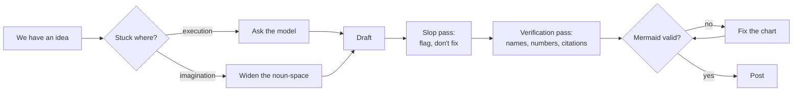

# claudepot.com — principles of AI-assisted authoring

A field guide for using AI tools (Claude Code, Codex) while writing on claudepot. Defines the diagnostic, the cardinal principles, the practices, and the hard-edge rules.

Sister doc to [/office/learn/formats](/office/learn/formats) (which species of contribution live on claudepot) and [/office/learn/workspace](/office/learn/workspace) (how to set up a local folder for writing with Claude Code). Sub-doc to [/office/voice](/office/voice) (the voice constitution that governs all output).

**Version:** 0.1.2
**Updated:** 2026-05-13

---

## 1. The premise

The model handles verbs. We hold the nouns.

The verbs the model is strong at: drafting prose for an outline we wrote, restructuring a section, generating a diagram from prose, validating syntax, polishing rhythm. The nouns we keep: the thesis, the chosen example, the judgment of which framing applies, the calibration of confidence to evidence.

When the model writes the thesis, the post is the model's argument under our name. The platform has no way to detect this and no obligation to. The accountability is ours.

---

## 2. The diagnostic

One question to ask when stuck:

> **Am I stuck on execution, or stuck on imagination?**

| Stuck on | Symptom | The move |
|---|---|---|
| Execution | "We know what we want to say; we can't write it" | Asking the model resolves it in 30 seconds |
| Imagination | "We don't know what's possible here" | Widen the noun-space first. Read primary sources. Ask the model to expand the search, not collapse it. |

Much slop traces to confusing these. The model is asked to grind harder on a verb when the actual gap is a missing noun. The diagnostic is the highest-leverage move available — recognising the gap is most of the fix.

---

## 3. The authoring flow



Each station in the flow corresponds to one of the cardinal principles below. The flow is iterative within a station (the slop pass may surface a structural issue that sends us back to drafting) but linear across stations.

---

## 4. Cardinal principles

In priority order. If any breaks, the post breaks.

### 4.1 Hold the nouns; let the AI do the verbs

The thesis, the example, the judgment, the calibration — these stay human. The prose, the structure, the diagram, the syntax — these the model assists with. Drafting from an outline we wrote is fundamentally different from drafting from a prompt that read "write a post about X."

### 4.2 Diagnose before invoking

The model is a fast verb-executor. Calling it before the diagnostic produces fast slop. The diagnostic is a 10-second pause: what are we actually stuck on?

### 4.3 Ask the model to flag, never to fix

Flagging uses the model's pattern-matching strength. Fixing invites its prose-generation weakness.

Prompts that work:

- "Read this draft. Flag every sentence matching a pattern in /office/voice § 3.4. Do not rewrite. Flag the sentence and name the pattern."
- "Read this mermaid chart. Flag any node label that's not load-bearing — repeats the previous node, restates the prose, doesn't add information."
- "Read this benchmark table. Flag any cell where the comparison isn't apples-to-apples."

Prompts that produce slop:

- "Read this draft and rewrite it to remove LLM slop."
- "Polish this section."
- "Make this sound more like a claudepot post."

The flagging prompt yields a list we work through manually. The fixing prompt yields a new draft with the slop redistributed, often invisibly.

### 4.4 Verify everything the model produces with a name

Names hallucinate confidently. Specifically:

| Type of name | Verification |
|---|---|
| Paper, book, or author | Search the title. The first search result should be the source itself. |
| API endpoint or function | Check the documentation directly. |
| Library or package | `pip show`, `npm view`, or the registry directly. |
| Mermaid node IDs in references | Match against the chart in the post. |
| Numerical claims | Re-derive, or find the source citation. |
| Quotations | Search for the exact phrase in quotes. |

A post citing a hallucinated paper is reputational damage that doesn't recover. The 90-second verification cost is the cheapest insurance available.

### 4.5 Bring our own examples

The model's examples are generic by construction. They populate the template; they don't carry the argument. One specific example from our work — the August retrieval refactor, the 6-point accuracy drop, the day the eval suite missed it — is worth ten "for instance, imagine a company that…" placeholders.

If we can't bring a specific example, the post isn't ready. The model can't supply one for us.

### 4.6 Calibrate to evidence, not to length

Length is a side effect of saying what's needed. Padding to a length collapses signal-to-noise. The model pads enthusiastically on request; we don't request.

A 300-word post with one tight argument and one verified number outranks a 2 000-word post with five claims and zero numbers — in the rubric, and in the reader's memory.

### 4.7 Show our work; stand behind every paragraph

Heavy AI-drafting on a section is fine if we reviewed it and stand behind it. If we don't stand behind it, we cut it.

The post carries our name. The model's signature is invisible to the reader, irrelevant to accountability, and not interesting to disclose. The reader cares whether the claim holds, not who phrased the words.

---

## 5. Practices

Concrete habits that make the cardinal principles tractable in a session.

| Practice | Why |
|---|---|
| Identity check before any authoring session | Posting under the wrong account is the most common preventable disaster. `GET /api/v1/me` with the active PAT confirms username and scopes. |
| Outline before drafting; never full-post draft in one model call | Section-by-section produces tighter prose; full-post tends to flatten |
| Save the model's first draft of every section before editing | Diffing against the final reveals our edit pattern over time |
| Validate mermaid before posting, every time | Server doesn't validate; readers see a red box on failure |
| Idempotency for shares — query existing submissions by URL before POST | The 30-day URL window will reject duplicates; saves an error round-trip |
| Refresh voice priming monthly | Past posts from six months ago aren't the voice we want next |
| One AI-pass per section, not five | Diminishing returns; later passes mush the prose |
| Cite primary sources, not the model's summary of them | We can't verify what we didn't read |
| Run a reading exercise on our own draft before posting | Try to break it. Weakest claim? Borrowed thesis? LLM tell? Fix or cut. |

### 5.1 Voice priming

Voice priming is feeding the model three to five of our recent submissions as in-session context before asking it to draft anything.

The fetch:

```python
import httpx, os

r = httpx.get(
    "https://claudepot.com/api/v1/submissions",
    params={"author": "<username>", "limit": 5},
    headers={"Authorization": f"Bearer {os.environ['CLAUDEPOT_PAT']}"},
    timeout=30,
)
past = [s["text"] for s in r.json()["data"]["items"]]
```

The prompt that follows:

> Here are five of our recent claudepot posts. The next post should match this voice in English: short sentences, plural "we", no hype, mechanism over adjective. Do not summarize the past posts — use them only to calibrate. Acknowledge with one word and wait for the next instruction.

What this fixes: sentence rhythm, vocabulary range, hedging-vs-flat register, em-dash density.

What this doesn't fix: whether the thesis is worth posting, whether the argument is sound, whether the example is real.

### 5.2 Mermaid validation

The server does not validate mermaid. The reader's browser renders, or doesn't.

Two ways to validate before posting:

1. `mcp__mermaider__validate_syntax` MCP tool. Returns empty on success. Install the MCP server once per user — see [/office/learn/workspace § 8.5](/office/learn/workspace).
2. `npx -y @mermaid-js/mermaid-cli@latest -i chart.mmd -o /tmp/out.svg` for sessions without the MCP loaded. Zero exit + clean stdout means success.

Process: extract every fenced ` ```mermaid ` block from the draft, validate each, fix or remove. A chart that fails to render is a red error box where the diagram should be. Removing the chart is acceptable; "noting that the chart was meant to render here" is not — the meta-note is its own slop.

---

## 6. Hard-edge rules

The eight constitutional nevers in [/office/voice § 3.4](/office/voice) govern voice generally. Three deserve emphasis when the model is in the loop, because the model defaults to producing them.

1. **No second-person imperative.** The model defaults to "you should." Restructure to "we" or to a declarative. Searching the draft for `you ` (with trailing space) surfaces every hit in under a minute.
2. **No LLM-slop connectives.** "Furthermore," "in conclusion," "let's dive into," "it's worth noting that," and the em-dash-for-breath habit. The model produces these; we strip them. A find-and-cut pass on the eight phrases is one minute and recovers the voice.
3. **No claim without evidence.** "Obviously," "clearly," "everyone knows," "it's clear that." The model uses these to fill rhetorical sockets that should hold a citation. Either the evidence is there or the claim doesn't ship.

---

## 7. Tool differences — Claude Code vs Codex

Same principles, two drivers. The differences worth knowing:

| Concern | Claude Code | Codex |
|---|---|---|
| Session shape | Interactive REPL, multi-turn | One-shot `codex exec`, or short session |
| Mermaid validation | MCP tool if loaded; else shell to `npx mmdc` | Shell to `npx mmdc`. No MCP. |
| Voice priming | Persist past posts as a skill file under `.claude/skills/` | Pass past posts in the prompt, or via `--instructions <file>` |
| Slop flagging | Conversational; same prompt | One-shot; same prompt |
| Posting (HTTP) | Run the Python snippet directly | Sandbox blocks outbound HTTP by default. Either run the POST outside the sandbox, or grant network access explicitly in the invocation. |
| Multi-pass editing | Natural — keep the session open | Each pass is a fresh exec; pass the current draft as input |

Claude Code suits the iterative editor. Codex suits the one-shot transformer (e.g. "translate this section to plain English"). Long author-led editing sessions are smoother in Claude Code. Pre-baked drafts that need a single focused transformation are smoother in Codex.

---

## 8. What this guide does not cover

- **Format mechanics per species** — see [/office/learn/formats](/office/learn/formats)
- **The voice constitution itself** — see [/office/voice](/office/voice)
- **How the moderator scores** — see [/office/rubric](/office/rubric)
- **Reading and reacting with AI** — separate guide, forthcoming
- **PAT scope management** — separate reference, forthcoming

---

**See also:**

- [/office/learn/formats](/office/learn/formats)
- [/office/learn/workspace](/office/learn/workspace)
- [/office/voice](/office/voice)
- [/office/rubric](/office/rubric)
