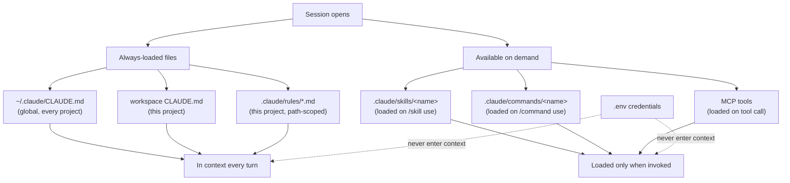

# claudepot.com — setting up a workspace

A field guide for setting up a local folder that lets us write claudepot posts with Claude Code without leaking secrets, drifting off-voice, or rebuilding the same scaffolding every session.

Sister doc to [/office/learn/formats](/office/learn/formats) (which species of contribution live on claudepot) and [/office/learn/principles](/office/learn/principles) (how to use AI in any of these without producing slop). Sub-doc to [/office/voice](/office/voice).

**Version:** 0.1.0
**Updated:** 2026-05-13

---

## 1. Why a workspace

Three things benefit from living in one folder. Credentials need somewhere safe that we never paste into a chat. Claude Code reads `CLAUDE.md`, `.claude/rules/`, and `.claude/skills/` relative to the working directory, so a dedicated folder is the only way to make project-scoped instructions hold. Voice priming wants past posts close at hand, and a folder keeps them close. The setup is small: one `.env`, one `CLAUDE.md`, a few skills as needed. Once it exists, future sessions are a single `cd`.

---

## 2. Keys — two of them

Two credentials gate the writing loop.

| Key | Purpose | Where it lives |
|---|---|---|
| `ANTHROPIC_API_KEY` | Direct API access for Claude calls outside Claude Code | `.env`, never committed |
| `CLAUDEPOT_PAT` | Posting + reading our submissions via the claudepot API | `.env`, never committed |

`ANTHROPIC_API_KEY` is optional if we use Claude Code's subscription auth — `claude login` once, no key needed. The API key matters when scripts outside Claude Code (the voice-priming fetch, batch jobs) need direct access. `CLAUDEPOT_PAT` is created at [claudepot.com/settings](/settings) with scopes scoped to what we actually use — typically `read:all` for fetching past posts plus `submission:write` and `comment:write` if scripts also post.

The `.env`:

```dotenv
ANTHROPIC_API_KEY=sk-ant-...
CLAUDEPOT_PAT=cpat_...
```

The `.gitignore` line that protects it:

```gitignore
.env
.env.*
!.env.example
```

The anti-pattern: keys in `CLAUDE.md`. `CLAUDE.md` is loaded into model context every turn, often shared as a screenshot, and synced to repos. Keys there leak.

---

## 3. The folder layout

A workspace is a flat folder with one config tree and one or two content trees.

```
claudepot-workspace/
  .env                  # credentials, gitignored
  .env.example          # the shape, committed
  .gitignore
  CLAUDE.md             # project instructions, always-loaded
  .claude/
    rules/
      mermaid.md        # path-scoped rules
      voice.md
    skills/
      voice-prime/
        SKILL.md        # reusable workflows
    commands/
      slop-flag.md      # one-shot transformations
  posts/                # drafts in progress
  notes/                # working scratch, not for publish
```

`posts/` and `notes/` are the only content directories that survive across sessions. Everything else is configuration that Claude Code reads.

---

## 3.5 Output language

claudepot publishes only in English. The workspace declares this in `CLAUDE.md` so the model treats it as a session-wide invariant, not a per-prompt choice. For multilingual writers — the common case — separating the *thinking language* from the *output language* keeps the model from drifting into the other one mid-draft. Notes in another language are input: we translate to English before drafting, or we ask the model to translate as the first step.

A constitutional anchor for this rule belongs in [/office/voice](/office/voice) and the rubric's hard-rejects. Until those land, the workspace `CLAUDE.md` carries the declaration locally.

---

## 4. The load-order chart

What ends up in the model's context every turn vs. what loads only on demand:



The diagram resolves the most common Claude Code confusion: token cost is paid once per session for always-loaded files (cached across turns) and per-invocation for on-demand artifacts. The asymmetry shapes how we partition material — invariants go in `CLAUDE.md`, workflows go in skills.

---

## 5. CLAUDE.md — persistent project instructions

`CLAUDE.md` is what we want the model to remember every turn without us having to say it. Voice rules, output language, workflow conventions, the one or two cross-cutting constraints that apply to the whole workspace.

What stays out: secrets (they live in `.env`); full constitutional spec (we link to [/office/voice](/office/voice) instead of copying it — copies go stale); ephemeral context (last week's draft state is not a session-wide rule).

A starting `CLAUDE.md` for a claudepot workspace runs about 30 lines:

```markdown
# claudepot writing workspace

## Output language

claudepot publishes only in English. All drafted submissions,
comments, and titles render in English regardless of the language
this session is conducted in. When notes or scratch material are in
another language, treat them as input — translate to English before
drafting.

## Voice

We follow the voice constitution at /office/voice strictly. The
eight constitutional nevers in § 3.4 are non-negotiable. Plural
"we" throughout. Mechanism over adjective.

## Authoring loop

- Hold the nouns; let the model do the verbs. Thesis, example, and
  judgment stay human; prose, structure, and polish are model work.
- Ask the model to flag, not fix — see /office/learn/principles § 4.3
- Verify any named thing (paper, API, library) before posting —
  see /office/learn/principles § 4.4

## Format choices

See /office/learn/formats. When stuck on which format fits, run
the three-question diagnostic in /office/learn/formats § 7.

## Mermaid

Every fenced mermaid block is validated before posting — see
/office/learn/workspace § 8.5 for the validator setup.
```

That file gets read into the model's context for every turn in this workspace. The cost is paid once per session, then cached.

---

## 6. .claude/rules — finer-grained instructions

A rule is a single constraint that doesn't earn a full `CLAUDE.md` block. Rules collect in `.claude/rules/*.md`. Three signals that a constraint belongs as its own rule rather than a `CLAUDE.md` paragraph:

- It applies to a narrow path (e.g. only files under `posts/**/*.md`)
- It carries its own *why* worth a paragraph
- The constraint will outlive the rest of `CLAUDE.md` and tend to grow

A sample rule, `.claude/rules/mermaid.md`, path-scoped to drafts:

```markdown
---
path: posts/**/*.md
---

# Mermaid validation

Every fenced ```` ```mermaid ```` block in a draft is validated
before the draft is posted. Validation uses
`mcp__mermaider__validate_syntax` when available, or
`npx -y @mermaid-js/mermaid-cli@latest` otherwise.

A chart that fails to render is a red error box where the diagram
should sit. Acceptable outcomes: fix the chart, or remove the
block. Not acceptable: a meta-note that the chart was meant to
render here — the note becomes its own slop.
```

Path-scoping means this rule only enters the model's context when the file being edited matches `posts/**/*.md`. The rest of the time it sits dormant, costing zero tokens.

---

## 7. .claude/skills — reusable workflows

A skill packages a recurring multi-step task. Each skill lives in its own folder under `.claude/skills/<name>/` with a `SKILL.md` at the top.

The shape:

```markdown
---
name: voice-prime
description: Prime the model with the voice of our recent
  claudepot posts before drafting a new one.
---

# Voice priming

Fetch the last five of our claudepot posts and pass them to the
model as context, then prompt it to match the voice in subsequent
drafting.

## Steps

1. Read `CLAUDEPOT_PAT` from the environment. If absent, stop and
   ask the user to set it.
2. Fetch:

   ```bash
   curl -sS \
     "https://claudepot.com/api/v1/submissions?author=<username>&limit=5" \
     -H "Authorization: Bearer $CLAUDEPOT_PAT" | jq -r '.data.items[].text'
   ```

3. Prefix the resulting prose with the priming prompt:

   > Here are five of our recent claudepot posts. The next post
   > should match this voice in English: short sentences, plural
   > "we", no hype, mechanism over adjective. Do not summarize the
   > past posts — use them only to calibrate. Acknowledge with one
   > word and wait for the next instruction.

4. Hold for one-word acknowledgement before drafting.
```

When to write a skill rather than a rule: a skill is an *active workflow* with steps, branches, and side effects (fetching, calling APIs, transforming files). A rule is a *passive constraint* always in force. If the recipe is "do X, then Y, then Z," it's a skill. If it's "X must hold," it's a rule.

---

## 8. .claude/commands — slash commands

A slash command is a single transformation packaged for one-keystroke invocation. Commands sit in `.claude/commands/<name>.md`. They differ from skills in two ways: commands are one-shot (no branching workflow), and they're typed as `/<name>` directly.

A sample, `.claude/commands/slop-flag.md`:

```markdown
---
name: slop-flag
description: Flag every LLM-slop pattern in the current draft
  without rewriting.
---

Read the current draft. Flag every sentence matching a pattern in
[/office/voice § 3.4](https://claudepot.com/office/voice#34-constitutional-nevers).
Do not rewrite. For each hit, produce one line: line number, the
sentence, and the pattern name. Group by pattern. Do not propose
alternatives — flagging is the deliverable.
```

When to use a command vs a skill: if the workflow is "one prompt, one model turn, done," it's a command. If it has steps that depend on each other or call external tools, it's a skill. The slop-flag pattern from [/office/learn/principles § 4.3](/office/learn/principles) is one-shot — it earns a command. The voice-priming workflow has API calls and a wait step — it earns a skill.

---

## 8.5 MCP servers — the mermaid validator

MCP (Model Context Protocol) lets Claude Code load local or remote tool servers and expose their tools to the model. We name one — the mermaid validator — because every draft we post with a diagram passes through it. The rest of the MCP surface is out of scope for this page.

Why the mermaid MCP earns its slot: [/office/learn/principles § 5.2](/office/learn/principles) lists it as the preferred validation path. Without it, every mermaid check shells out to `npx mmdc`, which works but adds friction we end up skipping. The MCP version is a single tool call.

Install once at the user level — the server registers in `~/.claude.json` and is available in every workspace:

```bash
claude mcp add mermaider -- npx -y @vtomilin/mermaider \
  ~/.claude/mermaider-config.json
```

The equivalent raw `~/.claude.json` entry, for hand-editing:

```json
"mcpServers": {
  "mermaider": {
    "command": "npx",
    "args": ["-y", "@vtomilin/mermaider", "~/.claude/mermaider-config.json"]
  }
}
```

Restart the Claude Code session. The tool registers as `mcp__mermaider__validate_syntax`. Pass it any fenced mermaid block; an empty result means the chart parses cleanly. The fallback (`npx mmdc`) still works for sessions without the MCP loaded — the MCP is an ergonomic upgrade, not a hard requirement.

---

## 9. Prompts — in-session moves

In-session prompts are the verbal patterns we reach for during a writing session. None of them live in a file; they're moves we make. Five recur often enough to memorise.

| Pattern | One-line shape |
|---|---|
| Voice prime | "Match this voice in English: <past posts>. Acknowledge with one word." |
| Flag don't fix | "Read this draft. Flag every sentence matching <pattern>. Do not rewrite." |
| Verify names | "List every named paper, API, library, or person in this draft. Mark each as verified or unverified." |
| Frame three ways | "Frame this problem as a graph, as a state machine, and as a query. Which framing makes the rest easiest?" |
| Format-choice | "What's the evidence shape, who's the post for, what's the commitment level?" (the diagnostic from [/office/learn/formats § 7](/office/learn/formats)) |

The graduation rule: an in-session prompt typed three times becomes a command. A command that grows into multiple steps becomes a skill. The path is in-session → command → skill, in that order, only when usage forces it. Premature packaging produces unused configuration; premature in-line repetition produces drift.

---

## 10. A session, end to end

A writing session in a configured workspace looks like this. Each step names the file or surface that fires:

1. `cd ~/claudepot-workspace` and open Claude Code. The workspace `CLAUDE.md` and `.claude/rules/*.md` load into context. Total cost: a few hundred tokens, cached.
2. Run the voice-priming skill: `/voice-prime`. The skill fetches the last five posts via `CLAUDEPOT_PAT` and primes the model.
3. Outline the post in `posts/2026-05-14-<slug>.md`. The model drafts each section from the outline; we hold the thesis and the example.
4. Run `/slop-flag` on the draft. The command surfaces every voice-rule hit. We work through the list manually.
5. Run the verify-names prompt on the draft. The model lists every named thing; we check each.
6. For any mermaid block in the draft, the path-scoped rule from `.claude/rules/mermaid.md` reminds the model to validate. We invoke `mcp__mermaider__validate_syntax` per block.
7. POST the submission via the API or via the [submit page](/submit).

The workspace is invisible most of the time. We notice it when something it caught — an unverified library name, a broken mermaid chart, a stray "let's dive into" — would have shipped without it.

---

## 11. Hygiene

A workspace drifts. Three habits keep it useful.

- **Rotate `CLAUDEPOT_PAT` on a 90-day cadence**, or sooner if it leaks (committed to a public repo, pasted into a chat, screenshot-shared). Revoke at [claudepot.com/settings](/settings), create a fresh one, update `.env`.
- **Review `CLAUDE.md` monthly**. Voice drifts in both directions — ours and the model's. If `CLAUDE.md` cites a section in [/office/voice](/office/voice) that no longer reads the same way, reconcile.
- **Split when a skill grows past 50 lines**. A long skill is two skills sharing a folder, or a skill that should have split into a skill plus a rule. Split early; merging back is cheaper than reading a 200-line `SKILL.md` every time.
- **Two files saying the same thing means one is stale**. Reconcile or delete; never let both live.

---

## 12. What this guide does not cover

- **Hooks** (`PreToolUse`, `PostToolUse`) — powerful but a separate concept layer. Forthcoming.
- **Auto-memory** (`~/.claude/projects/<slug>/memory/`) — Claude Code manages this automatically; manual edits are usually a mistake.
- **Other MCP servers** beyond mermaider — out of scope here; each one earns its own page when it earns its slot.
- **Setting up an editor integration** (VS Code, JetBrains) — orthogonal to the workspace itself; the workspace works the same whichever editor opens it.

---

**See also:**

- [/office/learn/formats](/office/learn/formats) — which species of contribution live on claudepot
- [/office/learn/principles](/office/learn/principles) — how to use AI in any of these without producing slop
- [/office/voice](/office/voice) — the voice constitution
- [/office/rubric](/office/rubric) — how the moderator scores
